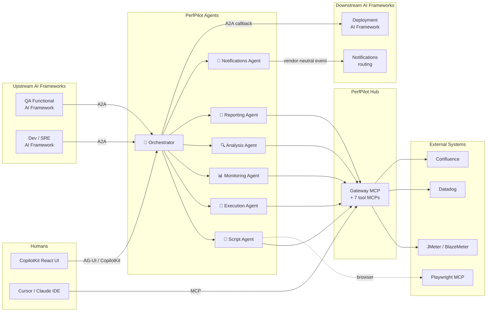
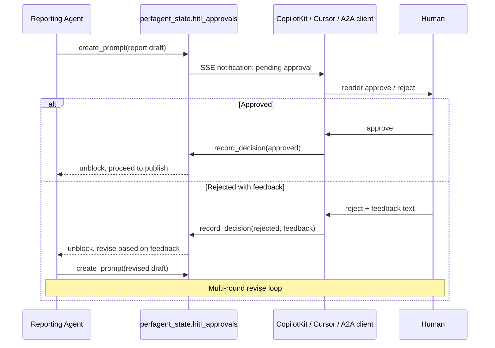

# ✈️ PerfPilot Agents

> **Your AI co-pilot for the entire Performance Testing Lifecycle — from
> test creation to results delivery, with a human at the controls when it
> matters.**

> ⚠️ **This module is in active development on the `ag2-agent-framework`
> branch.** APIs, file layouts, configuration schemas, and database DDL
> may change without notice until the branch merges to `main`. Several
> agents currently respond with a documented `not_available` message
> while their specialist behavior is being wired in. See the
> [Current status](#-current-status) table at the bottom of this README
> for what works today versus what is coming.

---

PerfPilot Agents is the **AG2-based AI agent layer** of the MCP Perf
Suite. It pairs with [**PerfPilot Hub**](../gateway-mcp/) (the unified
MCP gateway that exposes every performance-testing tool through a single
endpoint) to deliver the first open-source attempt at a fully-agentic,
end-to-end Performance Testing Lifecycle (PTLC) automation system —
with safe, deliberate human-in-the-loop gates at every consequential
step.

Think of it this way:

- **PerfPilot Hub** gives an AI agent *one* MCP endpoint to access
  JMeter, BlazeMeter, Datadog, Confluence, PerfMemory, and the rest.
- **PerfPilot Agents** is the squadron of specialist AI agents that
  actually flies the mission — generating scripts, executing tests,
  pulling metrics, correlating bottlenecks, writing reports, and
  delivering results, all coordinated by an orchestrator agent and all
  reachable over open protocols by other AI agent frameworks upstream
  and downstream.

---

## 🎯 What is PerfPilot Agents?

A multi-agent AI system that **autonomously runs performance tests**
while keeping humans in the loop for every consequential decision —
test launch, report approval, publication. The agents specialize by
PTLC phase, collaborate with each other, and just as importantly,
collaborate with **other AI agent frameworks** through the standard
[**A2A (Agent-to-Agent) protocol**](https://google.github.io/A2A/) —
so a QA Functional framework upstream can request a load test, and a
deployment-automation framework downstream can consume the results,
without ever knowing PerfPilot exists by name.

### 🚀 The vision

A performance test today usually means a human running through a
sequence of fragmented tools: record a script in JMeter, upload to
BlazeMeter, watch Datadog during the run, hand-correlate metrics
afterward, write a report, mail it around. PerfPilot Agents collapses
that entire pipeline into:

1. **Upstream framework** (or human in CopilotKit UI, Cursor, Claude
   IDE) submits a test request.
2. **PerfPilot Agents orchestrator** routes the work to its
   specialists.
3. **Specialists** generate the script, execute the test, pull
   monitoring data, correlate findings, and draft a report.
4. **Human reviewer** approves the report (or sends it back for
   revision — the agents iterate).
5. **Downstream framework** receives the results via webhook, A2A
   callback, or Confluence publication.

The human stays in the loop. The agents do the heavy lifting in
between.

### 🧠 Why "co-pilot" and not "autopilot"?

Every meaningful step is gated by a **Human-in-the-Loop (HITL)
approval prompt**. The agents are autonomous in *how* they do the work
(script generation, metric correlation, report drafting) — but they
never launch a load test, never publish a report, never spend cloud
credits without explicit human sign-off. This is a feature, not a
limitation: it's what makes PerfPilot safe to integrate into a real
SDLC pipeline at an enterprise scale.

---

## 🏗️ Architecture at a glance



**Two surfaces, two audiences:**

| Surface | Port | Audience | Protocol |
|---|---|---|---|
| **A2A server** | `8001` | Other AI agent frameworks (machine-to-machine) | A2A standard endpoints (path-routed per agent) |
| **AG-UI bridge** | `8002` | Browser-based humans (CopilotKit React UI), Cursor / Claude IDE | `/api/*` + `/copilotkit/` SSE stream |

Both surfaces talk to the same agent runtime. A request that arrives
over A2A and a request that arrives over a chat UI hit the *same*
orchestrator, run through the *same* specialists, and persist to the
*same* `perfagent_state` database. There is no "API tier" and "UI tier"
to keep in sync — there is one tier with two doors.

---

## 📦 What's inside this folder

| Path | Purpose |
|---|---|
| `a2a_server.py` | FastAPI entrypoint for the A2A surface on port 8001. Path-routes `/agents/{name}/...` to every enabled agent. |
| `agui_server.py` | FastAPI entrypoint for the AG-UI / CopilotKit bridge on port 8002. Hosts `/copilotkit/`, `/api/sessions`, `/api/runs`, `/api/events` SSE, `/api/hitl/*`, and (coming) `/api/threads`. Multi-user owner-filtered. |
| `agents/` | One subfolder per agent following a strict **four-file pattern** (`agent.py`, `agent_card.json`, `INSTRUCTIONS.md`, plus one of `config.yaml` / `config.example.yaml`). One orchestrator + six specialists. |
| `utils/` | Shared agent-layer infrastructure: LLM provider abstraction (OpenAI / Azure OpenAI / Ollama), per-agent loader, async PostgreSQL pool, session + thread + task + checkpoint + HITL stores, identity resolver, ownership guard. |
| `workflows/` | Agent-to-agent Python pipelines (e2e, extraction, analysis-report, comparison). |
| `frontend/` | CopilotKit React skeleton (`ui-react/`) plus the AG-UI bridge adapter. |
| `config/` | Runtime YAML: global LLM defaults, per-agent enable/disable, session-cookie tunables. |
| `sql/` | DDL for the new `perfagent_state` PostgreSQL database (seven JSONB tables: sessions, threads, tasks, checkpoints, conversation messages, tool-call traces, HITL approvals). |

For the deeper folder map, conventions (async-everywhere, lazy heavy
imports, four-file pattern), and per-agent config schema, see
[**AGENTS.md**](./AGENTS.md).

---

## 🧬 What makes PerfPilot Agents different?

| Traditional approach | PerfPilot Agents |
|---|---|
| JMeter alone → scripts but no execution layer or analysis | One orchestrator + specialists for every PTLC phase |
| BlazeMeter alone → load but no script generation, no correlation | Specialists chained: script generation → execution → monitoring → analysis → report |
| Datadog alone → observability but no test trigger or correlation | Monitoring agent runs *during* the test, correlated with BlazeMeter results by the analysis agent |
| Bespoke Python orchestration scripts | Declarative agent contract via AG2 + A2A — swap agents, swap LLM providers, swap MCP backends without rewriting glue code |
| Vendor-locked SaaS | Open protocols (A2A, MCP), pluggable LLMs (OpenAI / Azure / Ollama), pluggable backends (BlazeMeter / future cloud test runners) |
| Single-user CLI workflows | Multi-user, multi-thread, ChatGPT-style persistent conversations with strict per-user isolation |
| Stateless tool invocations | Every agent handoff persists state in `perfagent_state` — restart-safe, day-2-resumable |

---

## 🔌 Built on open protocols, not vendor lock-in

PerfPilot Agents is deliberately built on **open, vendor-neutral
protocols** at every layer:

- **[A2A protocol](https://google.github.io/A2A/)** for agent-to-agent
  discovery and task invocation. Every agent serves a standard
  `/.well-known/agent.json` card and exposes `tasks/send`,
  `tasks/sendSubscribe` (SSE), `tasks/{id}` (poll), and
  `tasks/{id}/cancel` per the spec — so any off-the-shelf A2A client
  (other agent frameworks, future tooling) can discover and drive
  PerfPilot without custom integration code.
- **[MCP (Model Context Protocol)](https://modelcontextprotocol.io/)**
  for all external tool I/O. Agents never call vendor SDKs directly —
  they route through PerfPilot Hub, which means swapping Datadog for
  New Relic, or BlazeMeter for k6 Cloud, means swapping the underlying
  MCP server, not changing agent code.
- **[AG-UI](https://docs.ag2.ai/) (Agent-User Interaction protocol)**
  for the browser-facing chat surface. Hosted natively by AG2's
  `AGUIStream`, with CopilotKit as the React frontend of choice but
  technology-agnostic by URL contract (`/api/perfpilot/chat` instead
  of `/api/copilotkit/...`).
- **OIDC / JWT** ready for upstream authentication. The Epic 3 identity
  resolver accepts any verifying middleware (Azure Container Apps Easy
  Auth, oauth2-proxy, AWS ALB + Cognito, GCP IAP, on-prem mTLS — your
  choice) without any vendor SDK imports in the agent layer.

The agent code does not care what cloud you deploy it to, what LLM you
plug in, what testing tools you swap behind PerfPilot Hub, or what
auth provider sits in front. **That's the point.**

---

## 🧠 Multi-user, multi-thread, persistent conversations

PerfPilot Agents is built from day one for multiple concurrent humans
and multiple concurrent AI frameworks calling the same backend safely:

- **Per-user thread isolation.** Alice's conversation history is
  invisible to Bob, even if they're both connected to the same
  PerfPilot instance. Enforced via ownership checks on every read
  endpoint (`/api/sessions`, `/api/runs`, `/api/events`,
  `/api/hitl/*`).
- **ChatGPT-style persistent threads.** Close your browser tab, come
  back tomorrow, pick up the conversation exactly where you left it —
  on the same device or a different one. State lives in
  `perfagent_state.conversation_messages`, not in browser memory.
- **A2A external thread resumption.** An upstream framework can pass
  `X-External-Thread-Id` to resume a prior conversation, or omit it
  and let PerfPilot auto-mint a thread ID (returned in the response
  header). Naive callers just work; sophisticated callers get explicit
  control.
- **Forward-compatible with cloud auth.** The identity resolver is a
  four-step chain (upstream-auth placeholder → `X-User-Id` header →
  server-issued cookie → freshly minted token). Epic 4 lights up the
  top step with any OIDC/JWT verifier without touching the resolver
  chain or the downstream owner-filtering logic.

---

## 🛡️ Human-in-the-loop, by design

Every consequential step in the PerfPilot pipeline is gated by a HITL
prompt. The agents draft, the human decides, the agents iterate:



HITL prompts are persisted (no agent state lost on restart), idempotent
(safe to retry), owner-filtered (Bob cannot approve Alice's pending
prompt), and reachable from any of the three client surfaces
(CopilotKit UI, Cursor IDE, external A2A framework). The
`request_human_approval` agent tool wraps the whole loop into a single
function call that specialists invoke when they need a green light.

---

## 🛠️ Try it today

> The full Docker-compose-based "one command and it runs" experience
> is staged for a later milestone. Today, the framework is exercised
> via Python smoke tests that boot the servers in-process and validate
> end-to-end behavior.

### Prerequisites

- Python 3.12+
- PostgreSQL 18 with pgvector + Apache AGE (existing
  `Dockerfile.pgvector-age.example` image works as-is — Epic 3 adds the
  `perfagent_state` database additively on the same instance)
- An LLM provider: OpenAI API key, Azure OpenAI deployment, or a local
  Ollama instance

### Sanity-check the current build

From the repo root:

```bash
# Start the existing perfmemory-db container (re-uses the existing image)
docker compose -f docker/docker-compose-windows.yaml up -d perfmemory-db   # or -mac
# Provision the new perfagent_state database additively
python agent-framework/sql/provision.py

# Run the smoke tests
python scripts/smoke_test_perfagent_state.py    # 25 checks: schema + CRUD + isolation
python scripts/smoke_test_a2a_server.py         # 26 checks: A2A surface + agent discovery
python scripts/smoke_test_agui_server.py        # 49 checks: AG-UI bridge + multi-user isolation
python scripts/smoke_test_llm_providers.py      # LLM provider abstraction
```

A green run on all four confirms the foundation works on your machine.

### How to follow along

PerfPilot Agents is being built in small, smoke-tested increments on
the `ag2-agent-framework` branch. The high-level
[Current status](#-current-status) table below tracks what works
today, and the [V2 architecture spec](#-where-to-learn-more) (kept in
the repository owner's local checkout while the design churns) is
gradually being distilled into the committed `AGENTS.md` and per-module
docstrings as features stabilize.

---

## 📊 Current status

A coarse, public-facing roadmap. Internal feature-level tracking lives
in the repository owner's local working notes; this table is updated
as each milestone group stabilizes.

| Area | Status | Notes |
|---|---|---|
| `perfagent_state` PostgreSQL database (7 JSONB tables) | ✅ Working | Sessions, threads, tasks, checkpoints, conversation messages, tool-call traces, HITL approvals — all CRUD with smoke coverage |
| Multi-LLM provider abstraction (OpenAI / Azure OpenAI / Ollama) | ✅ Working | Per-agent override + global fallback + TLS via standard env vars |
| **A2A server** (port 8001) — discovery, `tasks/send`, SSE, polling, webhooks, cancel | ✅ Working | All three callback patterns operational |
| **AG-UI / CopilotKit bridge** (port 8002) — `/copilotkit/`, sessions, runs, events, HITL | ✅ Working | Backend complete; Next.js + CopilotKit React frontend in progress |
| Multi-user isolation (Alice cannot see Bob's data) | ✅ Working | Owner-filtering on every read endpoint; 9 dedicated isolation smoke checks |
| Persistent threads (ChatGPT-style multi-day resumption) | ✅ Schema + CRUD live | Wire-up of DB-loaded conversation history is the next milestone |
| Identity resolver (vendor-neutral, Epic 4-ready) | ✅ Working | Four-step chain: upstream-auth → `X-User-Id` → server cookie → freshly minted token |
| 🎯 Orchestrator agent | 🟡 Scaffolded | `build_orchestrator()` factory live; delegation tools (list / delegate / status / approve) in progress |
| 🚀 Execution agent (BlazeMeter) — first vertical slice | ⏭ Next | Proves the platform end-to-end: A2A, DB, LLM, MCP namespace filtering, HITL |
| 📝 Script agent (Playwright / HAR / Swagger / existing-JMX input) | ⏭ Planned | Gated on external Microsoft Playwright MCP container integration |
| 📊 Monitoring agent (Datadog) | ⏭ Planned | Runs concurrently with execution to pull metrics during the test window |
| 🔍 Analysis agent | ⏭ Planned | Multi-source correlation (BlazeMeter + Datadog), bottleneck identification, SLA verdict |
| 📄 Reporting agent (with multi-round HITL revision) | ⏭ Planned | Drafts → human reviews → revises → publishes to Confluence |
| 📣 Notifications agent (vendor-neutral events) | ⏭ Planned | Emits `TestRunCompleted` events; Teams / SharePoint / Slack adapters wired in Epic 4 |
| CopilotKit React frontend (Next.js 14 + AG-UI) | ⏭ Planned | Talks to the real orchestrator once it lands |
| Docker compose for the agent stack (`docker-compose-a2a-local-*.yaml`) | ⏭ Planned | Four services: gateway, agents, db, Playwright MCP |
| Auth + OpenTelemetry hooks (default-off, Epic 4-ready) | 🟡 Hooks reserved | Placeholders in place; activation deferred to cloud deployment |
| Azure Container Apps / EntraID / Key Vault deployment | 🔮 Epic 4 | Vendor-agnostic by design — other clouds and auth providers are first-class targets |
| End-to-end workflows (`workflows/e2e_perf_pipeline.py` etc.) | 🔮 Later epic | Once the specialists are real |
| `Dockerfile.agents` + production-grade container | 🔮 Later epic | Local dev today; container hardening with the cloud-deploy milestone |

**Legend:** ✅ working today · 🟡 in progress · ⏭ next up · 🔮 later
milestone

---

## 📚 Where to learn more

- **Folder conventions, four-file agent pattern, per-agent config
  schema, async + lazy-import rules:** [AGENTS.md](./AGENTS.md)
- **PerfPilot Hub (the MCP gateway PerfPilot Agents calls into):**
  [../gateway-mcp/README.md](../gateway-mcp/README.md)
- **The MCP servers behind the gateway:** [JMeter](../jmeter-mcp/),
  [BlazeMeter](../blazemeter-mcp/), [Datadog](../datadog-mcp/),
  [PerfAnalysis](../perfanalysis-mcp/), [PerfReport](../perfreport-mcp/),
  [Confluence](../confluence-mcp/), [PerfMemory](../perfmemory-mcp/)
- **Post-test results hub (Streamlit UI):** [../streamlit-ui/](../streamlit-ui/)
- **AG2 (the multi-agent framework PerfPilot is built on):**
  [docs.ag2.ai](https://docs.ag2.ai/)
- **A2A protocol spec:** [google.github.io/A2A](https://google.github.io/A2A/)
- **MCP spec:** [modelcontextprotocol.io](https://modelcontextprotocol.io/)
- **CopilotKit (the React frontend framework):**
  [copilotkit.ai](https://www.copilotkit.ai/)

---

## 📜 License

MIT — see [../LICENSE](../LICENSE). Copyright © 2025 Jason Smallcanyon.

---

## 🤝 Contributing

PerfPilot Agents is in the active-construction phase on the
`ag2-agent-framework` branch. Issues, suggestions, and discussion are
welcome via GitHub — but be aware that everything in this folder is
subject to change while the foundation stabilizes. When the branch
merges to `main` it will arrive with a polished documentation pass, a
stable A2A + AG-UI contract, and a Docker-compose-based quick-start
that does not require running smoke tests by hand.

Happy testing! ✈️
