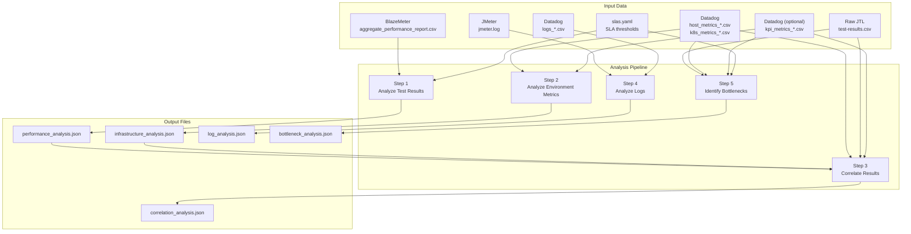
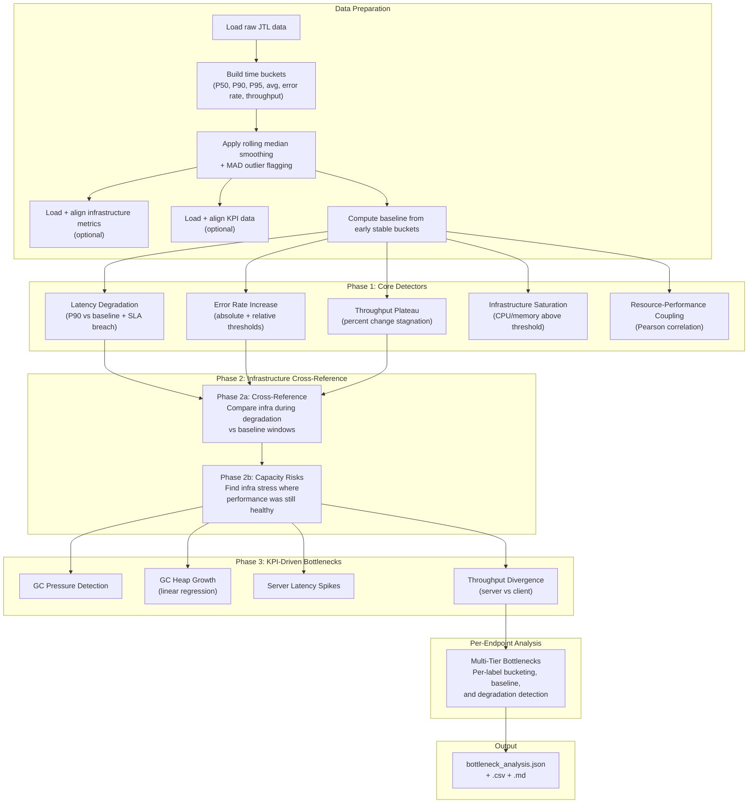

# PerfAnalysis MCP: Analytical Techniques Guide

This document explains every statistical algorithm and data science technique used by the **PerfAnalysis MCP** server to analyze performance test results. It is written for Performance Test Engineers -- including those without a data science background -- to understand *what* PerfAnalysis does under the hood, *why* each technique matters, and *how* they all fit together.

If you are looking for configuration details, see the companion guides:
- [SLA Configuration Guide](sla_configuration_guide.md) -- how to set up response time and error rate thresholds
- [Artifacts Guide](artifacts_guide.md) -- where files live and how MCP servers share them
- [Metrics Calculations and Display](metrics_calculations_and_display.md) -- how metrics flow from Datadog through to reports

---

## Table of Contents

- [1. What Is PerfAnalysis?](#1-what-is-perfanalysis)
- [2. The Analysis Pipeline](#2-the-analysis-pipeline)
- [3. Statistical Algorithms](#3-statistical-algorithms)
  - [3.1 Percentiles (P50, P90, P95, P99)](#31-percentiles-p50-p90-p95-p99)
  - [3.2 Descriptive Statistics (Mean, Min, Max, Standard Deviation)](#32-descriptive-statistics-mean-min-max-standard-deviation)
  - [3.3 Coefficient of Variation](#33-coefficient-of-variation)
  - [3.4 Pearson Correlation](#34-pearson-correlation)
  - [3.5 Linear Regression (Trend Detection)](#35-linear-regression-trend-detection)
  - [3.6 Z-Score Anomaly Detection](#36-z-score-anomaly-detection)
  - [3.7 Rolling Median Smoothing](#37-rolling-median-smoothing)
  - [3.8 Median Absolute Deviation (MAD)](#38-median-absolute-deviation-mad)
  - [3.9 Percent Change](#39-percent-change)
- [4. Data Science Techniques](#4-data-science-techniques)
  - [4.1 SLA Compliance Validation](#41-sla-compliance-validation)
  - [4.2 Temporal Correlation Analysis](#42-temporal-correlation-analysis)
  - [4.3 Trend Classification](#43-trend-classification)
  - [4.4 Outlier Suppression](#44-outlier-suppression)
  - [4.5 Sustained Degradation Detection (Persistence Check)](#45-sustained-degradation-detection-persistence-check)
  - [4.6 Multi-Factor Severity Scoring](#46-multi-factor-severity-scoring)
  - [4.7 Infrastructure Saturation Detection](#47-infrastructure-saturation-detection)
  - [4.8 Resource-Performance Coupling](#48-resource-performance-coupling)
  - [4.9 Capacity Risk Detection](#49-capacity-risk-detection)
  - [4.10 GC Heap Growth Detection](#410-gc-heap-growth-detection)
  - [4.11 Log Issue Grouping and Cross-Artifact Linking](#411-log-issue-grouping-and-cross-artifact-linking)
- [5. The Bottleneck Detection Engine](#5-the-bottleneck-detection-engine)
  - [5.1 Architecture Overview](#51-architecture-overview)
  - [5.2 Phase 1: Core Detectors](#52-phase-1-core-detectors)
  - [5.3 Phase 2a: Infrastructure Cross-Reference](#53-phase-2a-infrastructure-cross-reference)
  - [5.4 Phase 2b: Capacity Risk Detection](#54-phase-2b-capacity-risk-detection)
  - [5.5 Phase 3: KPI-Driven Bottlenecks](#55-phase-3-kpi-driven-bottlenecks)
  - [5.6 Per-Endpoint Multi-Tier Analysis](#56-per-endpoint-multi-tier-analysis)
- [6. What PerfAnalysis Produces](#6-what-perfanalysis-produces)
- [7. Configuration That Drives Analysis](#7-configuration-that-drives-analysis)
- [8. Glossary](#8-glossary)

---

## 1. What Is PerfAnalysis?

PerfAnalysis is the **analytical brain** of the MCP Performance Testing Suite. While BlazeMeter runs your load tests and Datadog collects your infrastructure metrics, PerfAnalysis is the MCP server that takes all of that raw data and answers the questions that matter:

- **Did the system meet its performance targets (SLAs)?**
- **Where did performance degrade and at what load level?**
- **Was the server infrastructure (CPU, memory) the limiting factor?**
- **Are there patterns in the data that suggest a memory leak or resource exhaustion?**
- **Which specific API endpoints are the weakest links?**

PerfAnalysis does this by applying a series of statistical algorithms and data science techniques to your test data, producing structured analysis files that the PerfReport MCP then uses to generate human-readable reports and charts.

### Where PerfAnalysis Fits in the Pipeline

```
BlazeMeter MCP          Datadog MCP           JMeter MCP
(load test results)     (infra metrics)       (log analysis)
        |                     |                     |
        v                     v                     v
    ┌─────────────────────────────────────────────────┐
    │              PerfAnalysis MCP                   │
    │  Analyze → Correlate → Bottleneck Detection     │
    └──────────────────────┬──────────────────────────┘
                           |
                           v
                    PerfReport MCP
                 (reports and charts)
                           |
                           v
                    Confluence MCP
                 (publish to wiki)
```

---

## 2. The Analysis Pipeline

PerfAnalysis runs a **five-step pipeline**, where each step builds on the results of the previous one. Think of it as an assembly line -- raw data goes in, and actionable findings come out.



### Step-by-Step Breakdown

| Step | MCP Tool | What It Does | Requires |
|------|----------|-------------|----------|
| **1. Analyze Test Results** | `analyze_test_results` | Reads the BlazeMeter aggregate CSV and computes per-API statistics (response times, percentiles, error rates, SLA compliance) | `aggregate_performance_report.csv`, `slas.yaml` |
| **2. Analyze Environment Metrics** | `analyze_environment_metrics` | Reads Datadog host or Kubernetes metrics and computes CPU/memory utilization summaries per server or service. Optionally analyzes KPI timeseries. | `host_metrics_*.csv` or `k8s_metrics_*.csv`, optional `kpi_metrics_*.csv` |
| **3. Correlate Results** | `correlate_test_results` | Time-aligns performance data with infrastructure metrics and computes Pearson correlation coefficients to find relationships (e.g., "does CPU go up when response times go up?") | Outputs from Steps 1 and 2, plus raw `test-results.csv` and Datadog CSVs |
| **4. Analyze Logs** | `analyze_logs` | Parses JMeter logs and Datadog log exports to identify errors, warnings, and patterns that correlate with performance issues | `jmeter.log`, `logs_*.csv` |
| **5. Identify Bottlenecks** | `identify_bottlenecks` | The most complex step. Loads the raw JTL data, slices it into time buckets, and runs multi-phase detection algorithms to find exactly when and why performance degraded. | `test-results.csv` (JTL), optional Datadog metrics and KPI data |

### Validation Gates

Each step has **prerequisites** -- files that must exist before the step can run:

- **Before Step 3:** Steps 1 and 2 must be complete (their JSON outputs are required inputs)
- **Before Step 5:** The raw JTL file (`test-results.csv`) must exist in the artifacts folder
- **SLAs:** A valid `slas.yaml` file must be present for Steps 1, 3, and 5

If a prerequisite is missing, PerfAnalysis will return an error with a clear message about what file is expected and where.

---

## 3. Statistical Algorithms

This section explains every statistical algorithm PerfAnalysis uses, in plain English.

### 3.1 Percentiles (P50, P90, P95, P99)

**What it is:** A percentile tells you the response time below which a given percentage of requests completed. For example, a P90 of 500ms means "90% of requests finished in 500ms or less."

**Why it matters:** Averages can be misleading. If 99 requests take 100ms and 1 request takes 10,000ms, the average is 199ms -- which hides the outlier. P90 and P95 reveal the experience of your slowest users, which is what SLAs typically measure.

**How PerfAnalysis uses it:**
- **Aggregate analysis:** Reads pre-computed P90, P95, and P99 from the BlazeMeter aggregate CSV for each API endpoint
- **Time-bucketed analysis:** Computes P50, P90, and P95 within each time window (bucket) from the raw JTL data using `quantile()`
- **SLA validation:** Compares the configured percentile (P90 by default, configurable per API) against the SLA threshold

**Benefit:** Percentiles give you an honest picture of how your system performs for the majority of users, not just the average case.

> **Source:** `statistical_analyzer.py` (aggregate analysis), `bottleneck_analyzer.py` (time-bucket analysis)

---

### 3.2 Descriptive Statistics (Mean, Min, Max, Standard Deviation)

**What it is:** These are the basic building blocks of statistical analysis:
- **Mean (average):** The sum of all values divided by the count
- **Min / Max:** The smallest and largest values observed
- **Standard Deviation (std dev):** How spread out the values are from the mean. A low std dev means consistent performance; a high std dev means highly variable performance.

**Why it matters:** Together, these metrics give you a complete snapshot of each API's behavior:
- **Mean** tells you the typical response time
- **Min/Max** reveal the best- and worst-case scenarios
- **Std dev** tells you how predictable performance is

**How PerfAnalysis uses it:**
- Every API endpoint gets a full set of descriptive statistics
- Standard deviation is used to compute the Coefficient of Variation (see below)
- Min/Max help identify endpoints with extreme outlier behavior
- KPI timeseries also get full descriptive summaries (min, max, avg, P90, P95, std dev, sample count)

**Benefit:** Descriptive statistics are the foundation of all further analysis. They turn thousands of raw data points into a concise summary.

> **Source:** `statistical_analyzer.py`, `kpi_utils.py` (`compute_metric_summary`)

---

### 3.3 Coefficient of Variation

**What it is:** The ratio of the standard deviation to the mean, expressed as a fraction or percentage. It answers: "How variable is this API's response time, relative to its average?"

**Formula:** `CV = standard_deviation / mean`

**Why it matters:** An API with a mean of 5000ms and a std dev of 500ms (CV = 0.1) is actually quite consistent. But an API with a mean of 100ms and a std dev of 500ms (CV = 5.0) is wildly unpredictable. The CV normalizes variability so you can compare across APIs with different average response times.

**How PerfAnalysis uses it:**
- APIs with high CV are flagged as "high variability APIs" in the statistical summary
- The default threshold is a std dev above 50ms, with CV computed for context
- Throughput CV is also checked in KPI analysis to detect inconsistent server-side throughput

**Benefit:** Quickly identifies the most unpredictable APIs that may need investigation, regardless of their absolute speed.

> **Source:** `statistical_analyzer.py` (`get_high_variability_apis`), `kpi_analyzer.py`

---

### 3.4 Pearson Correlation

**What it is:** Pearson correlation measures the linear relationship between two variables on a scale from -1.0 to +1.0:
- **+1.0** = perfect positive correlation (when one goes up, the other goes up)
- **0.0** = no correlation (the two variables are unrelated)
- **-1.0** = perfect negative correlation (when one goes up, the other goes down)

Think of it like this: if CPU usage and response time both climb together over the duration of the test, Pearson correlation will produce a number close to +1.0.

**Strength thresholds used by PerfAnalysis:**
- |coefficient| >= 0.7 = **strong** correlation
- |coefficient| >= 0.3 = **moderate** correlation
- |coefficient| < 0.3 = **weak** (not flagged as significant)

**Why it matters:** Performance testing generates multiple data streams -- response times, CPU, memory, throughput, SLA violations. Pearson correlation lets PerfAnalysis automatically discover which of these move together, revealing cause-and-effect relationships like "CPU spikes cause response time to degrade."

**How PerfAnalysis uses it:**
- **Temporal correlation** (Step 3): Time-aligns performance and infrastructure data into matching time windows, then computes Pearson correlation between:
  - CPU utilization vs. P90 response time
  - Memory utilization vs. P90 response time
  - CPU utilization vs. SLA violations
  - Memory utilization vs. SLA violations
- **Resource-performance coupling** (Bottleneck Step): Correlates P90 response time with CPU and memory across the post-warmup test window
- **KPI correlation**: Correlates application-level KPI metrics (GC pressure, server latency, thread counts) against performance and infrastructure columns

**Implementation note:** PerfAnalysis uses `pandas.Series.corr()`, which computes Pearson correlation by default. While `scipy.stats.spearmanr` is imported in the codebase, it is not currently used in any analysis path.

**Benefit:** Automatically finds the "smoking gun" -- the infrastructure resource or application metric most strongly linked to performance degradation, without manual investigation.

> **Source:** `statistical_analyzer.py` (temporal correlation, lines ~960), `bottleneck_analyzer.py` (resource-performance coupling), `kpi_analyzer.py` (`compute_kpi_correlations`)

---

### 3.5 Linear Regression (Trend Detection)

**What it is:** Linear regression fits a straight line through a series of data points. The **slope** of that line tells you the direction and rate of change:
- **Positive slope** = the metric is increasing over time
- **Negative slope** = the metric is decreasing over time
- **Near-zero slope** = the metric is stable

PerfAnalysis uses `numpy.polyfit(x, y, 1)` to compute a first-degree (linear) polynomial fit.

**Why it matters:** Some problems only reveal themselves over time. A memory leak, for example, looks fine in the first few minutes but steadily climbs. Linear regression detects these gradual trends that are invisible when you only look at averages.

**How PerfAnalysis uses it:**
- **KPI trend classification**: Fits a line through each KPI metric timeseries and classifies the trend as "stable", "increasing", or "decreasing" based on whether the cumulative change exceeds 10% of the mean
- **GC heap growth detection**: Fits a line through Gen2 heap size over time to detect potential memory leaks. If the predicted end value is 10%+ higher than the predicted start value, it flags a `gc_heap_growth` bottleneck

**Benefit:** Catches slow-moving problems (memory leaks, growing GC pressure, declining throughput) that snapshot-based analysis would miss.

> **Source:** `kpi_utils.py` (`_compute_trend`), `kpi_analyzer.py` (`_detect_gc_heap_growth`)

---

### 3.6 Z-Score Anomaly Detection

**What it is:** A Z-score tells you how many standard deviations a data point is from the mean. A Z-score of 2.5 means the value is 2.5 standard deviations above average -- which is unusual enough to be suspicious.

**Formula:** `z_score = (value - mean) / standard_deviation`

**How it works in PerfAnalysis:**
- Compute the mean and standard deviation of all response times
- Flag any individual request whose response time deviates from the mean by more than a configurable number of standard deviations:
  - **Low sensitivity:** 3.0 standard deviations (fewer alerts, only extreme outliers)
  - **Medium sensitivity:** 2.5 standard deviations (default)
  - **High sensitivity:** 2.0 standard deviations (more alerts, catches milder anomalies)

**Current status:** The Z-score anomaly detection tool (`detect_anomalies`) is **implemented but currently disabled** in the MCP tool registry. The code exists and can be enabled for future use.

**Why it matters:** Z-score detection is a straightforward way to identify individual requests or time periods that behave abnormally compared to the overall test. It is useful for finding one-off spikes or intermittent failures.

**Benefit:** A simple, well-understood approach to anomaly detection that requires no training data or complex configuration.

> **Source:** `statistical_analyzer.py` (`detect_statistical_anomalies`, lines ~1373-1411)

---

### 3.7 Rolling Median Smoothing

**What it is:** Instead of looking at each data point individually, a rolling median slides a window across the data and replaces each point with the median (middle value) of its neighbors. For example, with a 3-bucket window, each bucket's P90 is replaced with the median of itself and its two neighbors.

**Why a median instead of a mean?** The median is resistant to outliers. If three consecutive buckets have P90 values of [200, 200, 5000], the mean would be 1800 but the median stays at 200. This prevents a single spike from polluting the trend.

**Why it matters:** Load test data is noisy. A single garbage collection pause or network hiccup can produce a brief spike that looks like a bottleneck. Rolling median smoothing removes this noise so that the bottleneck detection algorithms focus on **sustained** trends, not isolated blips.

**How PerfAnalysis uses it:**
- Applied to six metrics in every time bucket: P50, P90, P95, average response time, error rate, and throughput
- The window size is configurable (default: 3 buckets)
- The original raw values are preserved in `_raw` columns for transparency

**Benefit:** Dramatically reduces false-positive bottleneck findings by filtering out transient noise, while preserving real sustained degradation.

> **Source:** `bottleneck_analyzer.py` (`_apply_outlier_filtering`, lines ~682-746)

---

### 3.8 Median Absolute Deviation (MAD)

**What it is:** MAD measures how much data points deviate from the median. It is similar to standard deviation but uses the median instead of the mean, making it much more resistant to outliers.

**How it is calculated:**
1. Compute the deviation of each raw P90 value from its smoothed (rolling median) value
2. Take the absolute value of each deviation
3. Compute the rolling median of those absolute deviations -- this is the MAD

**How PerfAnalysis uses it:**
- A time bucket is flagged as an **outlier** if its raw P90 deviates from the smoothed P90 by more than **2x the rolling MAD**
- Outlier buckets are excluded from baseline computation and do not trigger bottleneck findings
- This is applied both at the overall level and at the per-endpoint level

**Why it matters:** MAD provides a robust, data-driven threshold for outlier detection. Unlike fixed thresholds, it adapts to the actual variability of your test data.

**Benefit:** Automatically adapts to each test's noise level. A test with naturally high variability will have a higher MAD, so only truly extreme spikes get flagged.

> **Source:** `bottleneck_analyzer.py` (`_apply_outlier_filtering`, lines ~726-744)

---

### 3.9 Percent Change

**What it is:** The percentage difference between a current value and a reference value over a rolling window: `pct_change = (current - previous) / previous * 100`

**How PerfAnalysis uses it:**
- **Throughput plateau detection:** Computes the 3-bucket percent change in throughput. If concurrency is rising but throughput percent change falls below the plateau threshold (default: 5%), the system has hit its throughput ceiling.

**Why it matters:** A healthy system under increasing load should show increasing throughput (more users = more requests per second). When throughput stops growing despite more users, you have found the system's capacity limit.

**Benefit:** Directly answers the question "at what load level did the system stop scaling?"

> **Source:** `bottleneck_analyzer.py` (`_detect_throughput_plateau`, lines ~1338-1442)

---

## 4. Data Science Techniques

These are higher-level analytical techniques built on the statistical algorithms described above.

### 4.1 SLA Compliance Validation

**What it does:** Compares each API endpoint's response time percentile against its configured SLA threshold and produces a pass/fail result.

**How it works:**
1. Reads the SLA configuration from `slas.yaml`, which supports a hierarchy of thresholds:
   - File-level default (applies to all APIs unless overridden)
   - Profile-level default (per test profile, e.g., "order_management")
   - Per-API overrides using pattern matching (full label, `TC#_TS#`, or `TC#` patterns)
2. For each API endpoint, resolves the correct SLA threshold and percentile unit (P90, P95, or P99)
3. Compares the actual percentile value from the aggregate report against the threshold
4. Produces a compliance summary: how many APIs passed, how many failed, and by how much

**Why it matters:** SLA compliance is the primary success/failure criterion for a performance test. This technique automates what would otherwise be a manual spreadsheet exercise.

**Benefit:** Every API is checked against its own SLA, with support for different thresholds per endpoint -- no manual comparison needed.

> **Source:** `statistical_analyzer.py` (`analyze_sla_compliance`), `sla_config.py` (`get_sla_for_api`)

---

### 4.2 Temporal Correlation Analysis

**What it does:** Time-aligns performance data (response times, SLA violations) with infrastructure data (CPU, memory) into matching time windows, then computes Pearson correlation across those windows.

**How it works:**
1. Loads the raw JTL file and resamples it into fixed-width time windows (default: 60 seconds)
2. For each window, computes: average response time, max response time, P90, request count, and SLA violations
3. Loads Datadog infrastructure CSVs and resamples them into the same time windows
4. Merges the two datasets on timestamp
5. Computes Pearson correlation between:
   - CPU and response time
   - Memory and response time
   - CPU and SLA violations
   - Memory and SLA violations
6. Identifies "interesting" time windows where performance degraded or resources were constrained
7. Optionally correlates KPI metrics (GC pressure, server latency, etc.) against the same performance and infrastructure data

**Why it matters:** Simply knowing that "CPU was high" and "response times were high" is not enough. Temporal correlation proves (or disproves) that they happened **at the same time**, which is the evidence needed to make infrastructure scaling recommendations.

**Benefit:** Produces a correlation matrix with coefficients and strength labels that directly tell you "CPU was the primary driver of performance degradation" or "infrastructure was not a factor."

> **Source:** `statistical_analyzer.py` (`perform_temporal_correlation_analysis`, lines ~829-1061)

---

### 4.3 Trend Classification

**What it does:** Determines whether a timeseries metric is "stable", "increasing", or "decreasing" over the duration of the test.

**How it works:**
1. Fits a linear regression line through the timeseries data points
2. Computes the cumulative change: `slope * number_of_data_points`
3. Computes the relative change: `|cumulative_change| / mean`
4. If the relative change is less than 10% of the mean, the trend is **stable**
5. If it exceeds 10% and the slope is positive, the trend is **increasing**
6. If it exceeds 10% and the slope is negative, the trend is **decreasing**

**Why it matters:** An "increasing" trend on GC memory usage means the garbage collector is under growing pressure. A "decreasing" trend on throughput means the server is handling fewer requests over time. These are early warning signs of problems that may not have reached critical levels yet.

**Benefit:** Turns raw timeseries data into a simple, human-readable label that immediately conveys whether a metric is healthy or concerning.

> **Source:** `kpi_utils.py` (`_compute_trend`, lines ~344-371)

---

### 4.4 Outlier Suppression

**What it does:** Identifies and suppresses isolated data spikes that would cause false-positive bottleneck findings.

**How it works:**
1. Applies rolling median smoothing to all key metrics (P50, P90, P95, avg response time, error rate, throughput)
2. Computes the rolling MAD (Median Absolute Deviation) for P90
3. Flags any time bucket where raw P90 deviates from smoothed P90 by more than 2x the rolling MAD
4. Outlier-flagged buckets are:
   - Excluded from baseline computation
   - Skipped during bottleneck onset detection
   - Noted in finding evidence when they exist near a bottleneck

**Why it matters:** Without outlier suppression, a single 2-second garbage collection pause could be misidentified as a "latency degradation bottleneck" even though performance was perfectly healthy before and after. This technique ensures only sustained degradation triggers findings.

**Benefit:** Dramatically improves the signal-to-noise ratio of bottleneck analysis.

> **Source:** `bottleneck_analyzer.py` (`_apply_outlier_filtering`)

---

### 4.5 Sustained Degradation Detection (Persistence Check)

**What it does:** After detecting the first moment where a metric crosses a threshold ("onset"), validates that the degradation continues for a significant portion of the remaining test.

**How it works:**
1. Finds the **onset position** -- the first time bucket where the metric exceeds the threshold for a required number of consecutive buckets (default: 2)
2. Looks at all remaining buckets after the onset
3. Computes the **persistence ratio**: what fraction of remaining buckets stay above the threshold
4. If the persistence ratio exceeds the configured minimum (default: 60%), the degradation is classified as a **confirmed bottleneck**
5. If the persistence ratio is below the threshold, it is classified as a **transient spike** -- noted but with lower severity

**Why it matters:** Real bottlenecks persist. A system that briefly spikes under load but recovers is fundamentally different from one that degrades and never comes back. This technique distinguishes the two.

**Benefit:** Prevents "crying wolf" by only classifying sustained, irrecoverable degradation as a true bottleneck.

> **Source:** `bottleneck_analyzer.py` (`_check_persistence`, lines ~1015-1051)

---

### 4.6 Multi-Factor Severity Scoring

**What it does:** Assigns a severity level (critical, high, medium, low, info) to each bottleneck finding based on multiple dimensions, not just the magnitude of degradation.

**The four scoring dimensions:**

| Dimension | What It Measures | Score Range |
|-----------|-----------------|-------------|
| **Delta magnitude** | How far the metric deviated from baseline (25%, 50%, 100% thresholds) | 0-3 |
| **Persistence** | What fraction of the remaining test stayed degraded (50%, 70%, 90% thresholds) | 0-3 |
| **Scope** | Whether the degradation affects all APIs ("overall") or a single endpoint | 0-1 |
| **Classification** | Whether it is a confirmed bottleneck, a transient spike, or a known-slow endpoint | Override |

The total score (0-7) maps to severity:
- 7 = **critical** (severe delta + persistent + wide scope)
- 5-6 = **high**
- 3-4 = **medium**
- 1-2 = **low**
- `known_slow_endpoint` = always **info**
- `transient_spike` = capped at **low**

**Why it matters:** A 30% latency increase that only lasts 2 minutes is less concerning than a 30% increase that persists for the rest of the test across all endpoints. Multi-factor scoring captures this nuance.

**Benefit:** Produces severity ratings that match human intuition about what is truly urgent vs. what is informational.

> **Source:** `bottleneck_analyzer.py` (`_classify_severity_v2`, lines ~939-1012)

---

### 4.7 Infrastructure Saturation Detection

**What it does:** Detects when CPU or memory utilization exceeds configured thresholds for a sustained period.

**How it works:**
1. Scans the post-warmup time buckets for consecutive periods where avg CPU >= threshold (default: 80%) or avg memory >= threshold (default: 85%)
2. If sustained for the required number of consecutive buckets, flags as infrastructure saturation
3. CPU >= 90% is rated **critical**; >= 80% is rated **high**
4. Memory >= 95% is rated **critical**; >= 85% is rated **high**

**Why it matters:** When a server's CPU or memory is maxed out, the system physically cannot process requests faster. Identifying saturation points tells the team exactly where to scale.

**Benefit:** Provides clear, threshold-based evidence for infrastructure scaling decisions.

> **Source:** `bottleneck_analyzer.py` (`_detect_infra_saturation`, lines ~1449-1526)

---

### 4.8 Resource-Performance Coupling

**What it does:** Computes Pearson correlation between P90 response time and CPU/memory utilization across the post-warmup test window to determine if infrastructure metrics are a contributing factor to performance degradation.

**How it works:**
1. Extracts the post-warmup portion of the time-bucketed data
2. Drops any buckets with missing infrastructure data
3. Computes `p90.corr(avg_cpu)` and `p90.corr(avg_memory)`
4. A correlation coefficient with |value| >= 0.5 is flagged as significant
5. The finding records the correlation coefficient, strength ("strong" >= 0.7, "moderate" >= 0.5), and direction

**Why it matters:** This answers a specific question: "As CPU/memory increased during the test, did response times increase too?" A strong positive correlation means the infrastructure is directly impacting performance.

**Benefit:** Provides statistical evidence (not just co-occurrence) that infrastructure pressure is driving latency -- or that it is not, indicating the bottleneck is elsewhere (application code, database, etc.).

> **Source:** `bottleneck_analyzer.py` (`_detect_resource_performance_coupling`, lines ~1533-1592)

---

### 4.9 Capacity Risk Detection

**What it does:** Identifies infrastructure stress that occurs when performance is still healthy -- the system is coping today, but has limited headroom for tomorrow.

**How it works:**
1. Scans for sustained periods where CPU or memory exceeds thresholds
2. Checks whether those periods overlap with any Phase 1 degradation windows
3. If the infrastructure was stressed but performance held, it is classified as a **capacity risk** (not a bottleneck)
4. Computes headroom: `100% - average_utilization` during the stressed period
5. Also detects **climbing trends**: splits the test into first half and second half, and flags if the second-half average exceeds the first-half average by 30% or more

**Why it matters:** Capacity risks are the warning signs that precede real bottlenecks. If CPU averages 82% during your 100-user test and performance is fine, what happens at 150 users? This finding tells the team to scale proactively.

**Benefit:** Shifts the conversation from reactive ("it broke at 100 users") to proactive ("we have 18% CPU headroom before it will break").

> **Source:** `bottleneck_analyzer.py` (`_detect_capacity_risks`, lines ~1867-2198)

---

### 4.10 GC Heap Growth Detection

**What it does:** Detects sustained growth in the .NET/Java Gen2 garbage collection heap, which may indicate a memory leak.

**How it works:**
1. Finds the Gen2 heap size column in the KPI data
2. Converts timestamps to elapsed seconds
3. Fits a linear regression line: `slope, intercept = np.polyfit(time_seconds, heap_size, 1)`
4. Predicts the heap size at the start and end of the test using the regression line
5. Computes the growth percentage: `(predicted_end - predicted_start) / predicted_start * 100`
6. If growth exceeds the threshold (default: 10%), flags a `gc_heap_growth` finding with the growth rate per minute

**Why it matters:** Memory leaks are one of the most dangerous performance problems because they worsen over time and can eventually crash the application. A 30-minute load test may not trigger a crash, but linear regression can extrapolate the trend and flag the risk.

**Benefit:** Catches memory leaks that would be invisible in a short test, by mathematically projecting the growth trend.

> **Source:** `kpi_analyzer.py` (`_detect_gc_heap_growth`, lines ~742-815)

---

### 4.11 Log Issue Grouping and Cross-Artifact Linking

**What it does:** Analyzes JMeter logs and Datadog log exports to identify error patterns, then cross-references them with performance and infrastructure findings.

**How it works:**
1. Parses JMeter logs for errors, warnings, and exceptions
2. Parses Datadog log CSVs for application errors
3. Groups issues by pattern (e.g., similar error messages are clustered together)
4. Links log issues to existing performance and infrastructure analysis JSON files where applicable

**Why it matters:** Performance degradation often has a root cause visible in the logs -- connection timeouts, out-of-memory errors, thread pool exhaustion. Log analysis connects these error signals to the quantitative findings from other analysis steps.

**Benefit:** Provides qualitative context ("why did it break?") to complement the quantitative analysis ("when and how badly did it break?").

> **Source:** `log_analyzer.py`

---

## 5. The Bottleneck Detection Engine

The bottleneck detection engine (`identify_bottlenecks` tool) is the most sophisticated component of PerfAnalysis. It runs a multi-phase analysis pipeline to answer the core performance question: **"At what concurrency level does system performance begin to degrade, and what is the limiting factor?"**

### 5.1 Architecture Overview



### 5.2 Phase 1: Core Detectors

Phase 1 scans the time-bucketed data for the four fundamental types of performance degradation. Each detector works independently and produces zero or more findings.

#### Latency Degradation

Detects when the P90 response time increases beyond a configurable percentage above the baseline (default: 25%). Uses the persistence check to confirm the degradation is sustained.

Also checks for **SLA breach**: if P90 exceeds the configured SLA threshold from `slas.yaml`.

#### Error Rate Increase

Detects when the error rate exceeds either an absolute threshold (default: 5%) or 2x the baseline error rate, whichever is lower. Uses persistence check.

#### Throughput Plateau

Detects when throughput (requests per second) stops increasing even as concurrency rises. Computed using 3-bucket percent change -- if concurrency rises by 5%+ but throughput changes by less than 5%, the system has plateaued. Uses persistence check.

#### Infrastructure Saturation

Detects when CPU or memory utilization exceeds configured thresholds for a sustained number of consecutive buckets.

#### Resource-Performance Coupling

Computes Pearson correlation between P90 and CPU/memory across the post-warmup window. Strong or moderate correlations are flagged.

### 5.3 Phase 2a: Infrastructure Cross-Reference

After Phase 1 identifies **when** performance degraded, Phase 2a asks **"was the infrastructure stressed during that same period?"**

For each Phase 1 degradation window:
1. Extract the average CPU and memory during the degradation period
2. Extract the average CPU and memory during the baseline (healthy) period
3. Compute the delta percentage between them
4. Classify the finding as:
   - **infrastructure_correlated:** CPU or memory delta >= 25%, or exceeds threshold. "The server was struggling."
   - **infrastructure_independent:** Infrastructure metrics were stable during degradation. "The bottleneck is in your code, database, or external dependencies."
   - **inconclusive:** No infrastructure data available for this time window.

This context is attached to each Phase 1 finding as an `infrastructure_context` block, giving the reader immediate insight into whether scaling infrastructure would help.

### 5.4 Phase 2b: Capacity Risk Detection

Phase 2b scans for periods of infrastructure stress that do **not** overlap with any Phase 1 degradation windows. These are situations where CPU or memory was high but performance held -- the system was coping but had limited headroom.

It also detects **climbing resource trends** by comparing the first-half average to the second-half average. A 30%+ increase is flagged as a capacity risk.

### 5.5 Phase 3: KPI-Driven Bottlenecks

When optional KPI timeseries data is available (from Datadog `kpi_metrics_*.csv` files), Phase 3 runs four additional detectors:

| Detector | What It Looks For |
|----------|-------------------|
| **GC Pressure** | GC memory load exceeds threshold (default: 85%) concurrent with latency degradation |
| **GC Heap Growth** | Sustained Gen2 heap size increase detected via linear regression (default: 10%+ growth) |
| **Server Latency Spikes** | Server-side P99/max latency spikes (3x or more above its own baseline) coinciding with client-side degradation |
| **Throughput Divergence** | Server-side request hits diverge from client-side throughput by 30%+ in a significant fraction of time windows, suggesting requests are being dropped or unevenly distributed |

### 5.6 Per-Endpoint Multi-Tier Analysis

After the overall analysis, PerfAnalysis runs per-endpoint (per-label) analysis. Each API endpoint gets its own:
- Time-bucketed metrics with rolling median smoothing and MAD-based outlier detection
- Per-label baseline (from its own early buckets, not the overall baseline)
- Degradation detection against its own baseline and its own SLA
- Classification as:
  - **bottleneck**: endpoint degrades from its own baseline AND exceeds SLA under load
  - **known_slow_endpoint**: endpoint is always above SLA (even at baseline) -- informational, not a new degradation
  - **transient_spike**: brief degradation that recovers

---

## 6. What PerfAnalysis Produces

All output files are written under `artifacts/{test_run_id}/analysis/`. Each analysis step produces structured JSON (machine-readable), CSV (spreadsheet-friendly), and Markdown (human-readable) formats.

| Step | Output Files | Description |
|------|-------------|-------------|
| **Analyze Test Results** | `performance_analysis.json`, `performance_summary.csv`, `performance_summary.md` | Per-API response time statistics, SLA compliance, overall summary |
| **Analyze Environment Metrics** | `infrastructure_analysis.json`, `infrastructure_summary.csv`, `infrastructure_summary.md` | CPU/memory utilization summaries per host or Kubernetes service |
| **Analyze KPI Metrics** (optional) | `kpi_analysis.json`, `kpi_summary.md` | Per-service, per-metric KPI summaries with trend classification |
| **Correlate Results** | `correlation_analysis.json`, `correlation_matrix.csv`, `correlation_analysis.md` | Pearson correlation coefficients, significant correlations, temporal analysis periods, and insights |
| **Analyze Logs** | `log_analysis.json`, `log_analysis.csv`, `log_analysis.md` | Error patterns, issue groupings, cross-artifact links |
| **Identify Bottlenecks** | `bottleneck_analysis.json`, `bottleneck_analysis.csv`, `bottleneck_analysis.md` | Multi-phase bottleneck findings with severity, evidence, onset timestamps, infrastructure context, and persistence ratios |

### JSON Structure Highlights

The JSON files are designed to be consumed by the PerfReport MCP for automated report generation. Key structures:

- **`performance_analysis.json`**: Contains `overall_stats`, `api_analysis` (per-API detail), `sla_analysis` (compliance summary with violations list), and `statistical_summary`
- **`correlation_analysis.json`**: Contains `correlation_matrix` (four Pearson coefficients), `significant_correlations` (with strength/direction labels), `analysis_periods` (per-window detail with API breakdown), and `kpi_correlations` (optional)
- **`bottleneck_analysis.json`**: Contains `findings` (list of structured findings, each with `bottleneck_type`, `severity`, `concurrency`, `evidence`, `persistence_ratio`, and `infrastructure_context`), `baseline`, `bucket_count`, and `summary`

---

## 7. Configuration That Drives Analysis

PerfAnalysis is highly configurable. Here are the key configuration knobs and where they live:

### SLA Configuration (`slas.yaml`)

Defines response time thresholds and percentile units per test profile and per API endpoint. See [SLA Configuration Guide](sla_configuration_guide.md) for details.

Key settings:
- `response_time_sla_ms`: threshold in milliseconds
- `sla_unit`: which percentile to evaluate (P90, P95, or P99)
- `error_rate_threshold`: error rate percentage threshold (configured but not currently enforced in aggregate analysis)
- `api_overrides`: per-API pattern-matched thresholds

### Analysis Configuration (`config.yaml`)

Under the `perf_analysis` section:

| Setting | Default | Purpose |
|---------|---------|---------|
| `correlation_granularity_window` | 60 (seconds) | Size of time windows for temporal correlation |
| `correlation_threshold` | 0.3 | Minimum |coefficient| for a correlation to be flagged as significant |
| `statistical_confidence` | 0.95 | Reserved for future use |
| `resource_thresholds.cpu.high` | 80 (%) | CPU utilization threshold for saturation detection |
| `resource_thresholds.memory.high` | 85 (%) | Memory utilization threshold for saturation detection |

### Bottleneck Configuration (`config.yaml > perf_analysis.bottleneck_analysis`)

| Setting | Default | Purpose |
|---------|---------|---------|
| `bucket_seconds` | 60 | Width of each time bucket in seconds |
| `warmup_buckets` | 2 | Number of initial buckets to skip (JMeter ramp-up period) |
| `sustained_buckets` | 2 | Consecutive degraded buckets required before flagging onset |
| `persistence_ratio` | 0.6 | Minimum fraction of remaining test that must stay degraded |
| `rolling_window_buckets` | 3 | Window size for rolling median smoothing |
| `latency_degrade_pct` | 25.0 | P90 must increase by this percentage over baseline to trigger |
| `error_rate_degrade_abs` | 5.0 | Absolute error rate threshold (%) |
| `throughput_plateau_pct` | 5.0 | Throughput change below this = plateau |
| `raw_metric_degrade_pct` | 50.0 | Relative increase threshold when K8s limits are not set |
| `max_jtl_rows` | None (all) | Cap on JTL rows to limit memory usage on very large files |

---

## 8. Glossary

| Term | Definition |
|------|-----------|
| **API / Endpoint** | A specific URL or transaction in a load test. In JMeter, these correspond to sampler labels. |
| **Baseline** | The performance metrics computed from the first stable time buckets after warmup, representing "normal" performance before load increases. |
| **Bottleneck** | A sustained degradation in performance that does not recover, typically caused by a resource constraint or application limitation. |
| **Concurrency** | The number of virtual users (threads) actively executing requests at the same time. |
| **Correlation** | A statistical measure of how strongly two variables move together. PerfAnalysis uses Pearson correlation (values from -1.0 to +1.0). |
| **CV (Coefficient of Variation)** | Standard deviation divided by the mean. Measures relative variability. |
| **GC (Garbage Collection)** | The automated memory management process in runtimes like .NET and Java. GC pauses can cause latency spikes. |
| **Gen2 Heap** | In .NET, the portion of managed memory for long-lived objects. Sustained growth may indicate a memory leak. |
| **JTL** | JMeter Test Log -- the raw CSV file containing one row per HTTP request with timestamp, response time, success/failure, and thread count. |
| **KPI (Key Performance Indicator)** | Application-level metrics from APM tools (e.g., GC pressure, server-side latency, thread counts) that complement infrastructure CPU/memory data. |
| **Latency** | The time it takes for a request to complete. In performance testing, this is typically measured as "response time" or "elapsed time" in milliseconds. |
| **Linear Regression** | Fitting a straight line to data points. PerfAnalysis uses the slope to determine if a metric is trending up, down, or stable. |
| **MAD (Median Absolute Deviation)** | A robust measure of data spread that uses medians instead of means, making it resistant to outliers. |
| **Onset** | The specific moment (time bucket and concurrency level) when a bottleneck first manifests. |
| **P90 / P95 / P99** | The 90th, 95th, and 99th percentile response times. P90 means "90% of requests were faster than this." |
| **Pearson Correlation** | A measure of the linear relationship between two variables, ranging from -1.0 (perfect negative) to +1.0 (perfect positive). |
| **Persistence Ratio** | The fraction of remaining time buckets (after onset) where degradation continues. Used to distinguish sustained bottlenecks from transient spikes. |
| **Rolling Median** | A smoothing technique that replaces each data point with the median of its neighbors within a sliding window. Resistant to outlier spikes. |
| **Saturation** | When a resource (CPU, memory) reaches its maximum capacity. Typically CPU > 80-90% or memory > 85-95%. |
| **SLA (Service Level Agreement)** | A defined performance target, such as "P90 response time must be under 3000ms." |
| **Standard Deviation** | A measure of how spread out values are from the mean. High std dev = inconsistent performance. |
| **Throughput** | The number of requests processed per second (RPS). A healthy system's throughput should increase proportionally with concurrency. |
| **Time Bucket** | A fixed-width time window (default: 60 seconds) used to aggregate JTL data for trend analysis. Each bucket contains aggregated metrics (percentiles, error rate, throughput). |
| **Transient Spike** | A brief period of degradation that recovers on its own, as opposed to a sustained bottleneck. Classified with lower severity. |
| **Warmup** | The initial period of a load test (default: first 2 buckets) where JMeter is ramping up threads. Excluded from baseline and bottleneck detection. |
| **Z-Score** | The number of standard deviations a value is from the mean. Used to identify statistical anomalies. |
